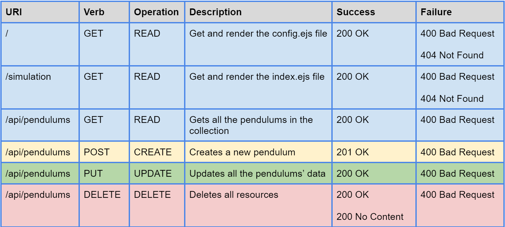
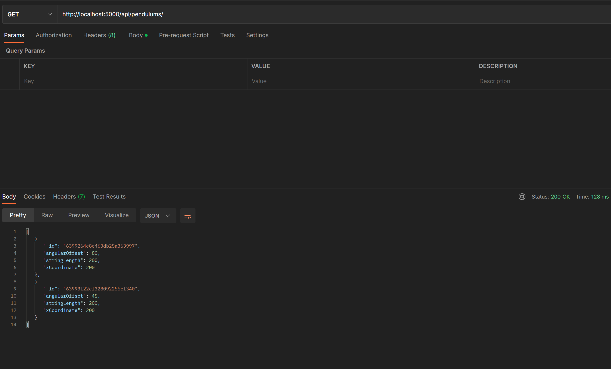
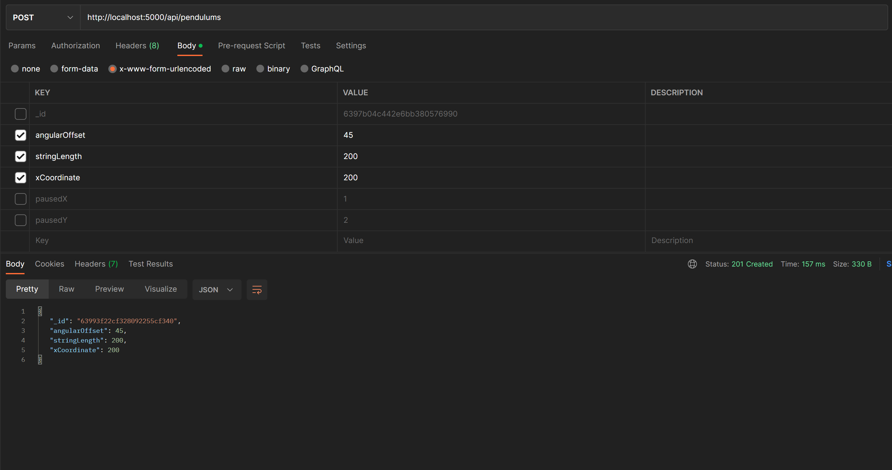

# [Simple Pendulum Application](https://simple-pendulum-gevorgalaverdyan.onrender.com)

This project is REST API which simulates Simple Pendulum(s).
 
Project's concepts and technologies include:

    > REST API
        - HTTP :
            -> POST
            -> GET
            -> PUT
            -> DELETE

    > Node JS / Express
    > MongoBD
    > Architectural Pattern
    > EJS: Embedded JavaScript *(instead of HTML) 
    > CSS

### API Endpoints

<table>
    <tr>
        <td></td>
    </tr>
</table>

### Sample Endpoints using Postman

<table>
    <tr>
        <td></td>
        <td>[HttpGET] Gets all the pendulums in the collection</td>
    </tr>
    <tr>
        <td>[HttpPost] Creates a new command, returns the new pendulum with status code of "201 Created"</td>
        <td></td>  
    </tr>
</table>

<i>*Note: EJS was used as an alternative to HTML because the backend wouldn't render a static HTML file.  The embedded feature of EJS was not used to stick to HTML format.</i>
