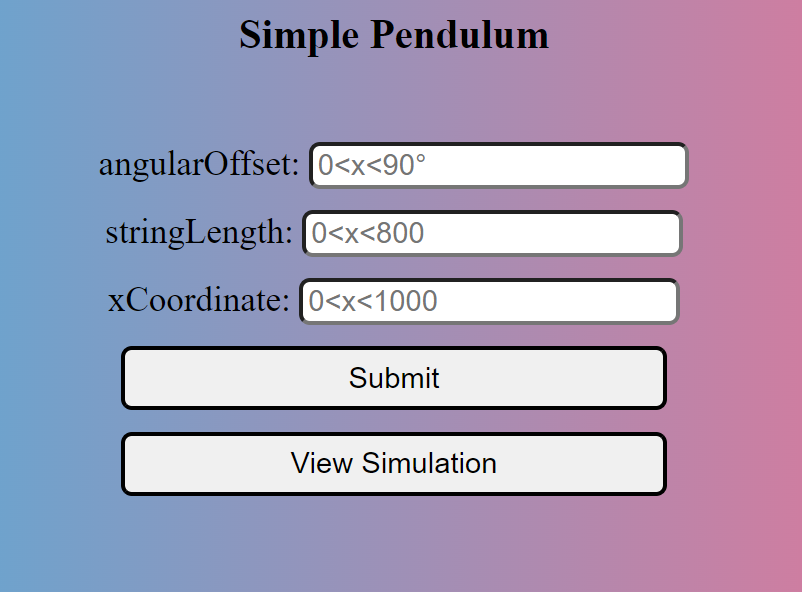
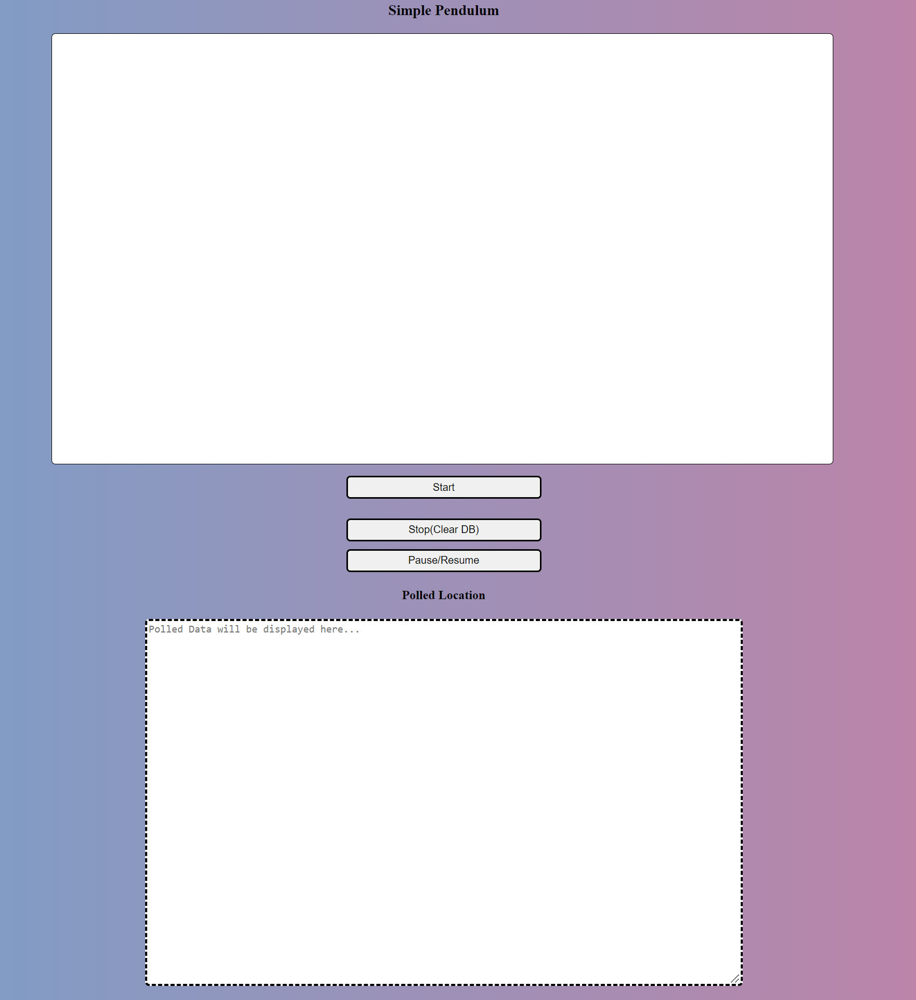
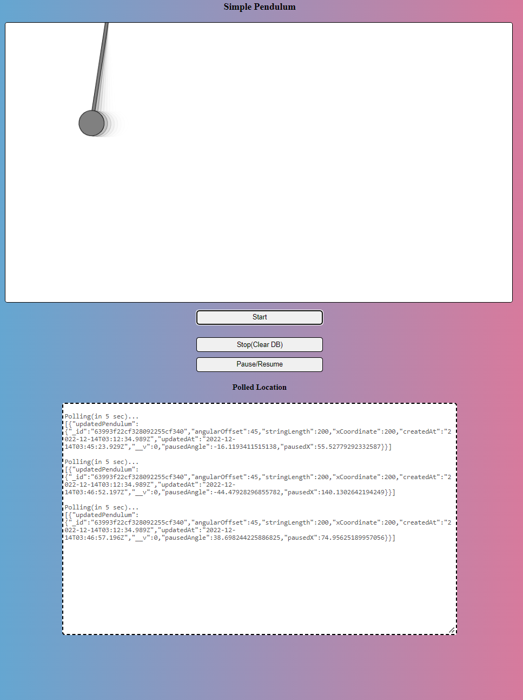

# [Simple Pendulum Application](https://simple-pendulum-gevorgalaverdyan.onrender.com)

This project is REST API which simulates Simple Pendulum(s).
 
Project's concepts and technologies include:

    > REST API
        - HTTP :
            -> POST
            -> GET
            -> PUT
            -> DELETE

    > Node JS / Express
    > MongoBD
    > Architectural Pattern
    > EJS: Embedded JavaScript *(instead of HTML) 
    > CSS

## User GUIDE

<table>
    <tr>
        <td></td>
        <td>The server will do a <code>GET</code> request to <code>localhost:PORT/</code>
        and render the config page as a response.  
        The main page will be the Configs page where the users can add pendulums. The range of values is indicated in the placeholder of the input field.  
        The DB has already some pendulum instances in it, but you can add as many as you desire.
        Once you filled all the input fields, click Submit.
        It will do a <code>HTTP POST</code> and if the data is valid save in the MongoDB Collection. A 201 status will be sent along with the new instance.
        Then, click View Simulation to go to simulation page.  
        </td>
    </tr>
    <tr>
        <td>The server will do a <code>GET</code> request to <code>localhost:PORT/simulation</code> and render the simulation page as a response. 
        The Top white rectangle is a 2D context CANVAS which will draw the simulation.  The Bottom white rectangle is also a TextBox which will display the information of the pendulums which are periodically polled (each 5 sec) and send a <code>PUT</code> request which updates the angle of the pendlum and the location of the pendulum according to x-axis. 
        </td>
        <td></td>  
    </tr>
    <tr>
        <td></td>  
        <td>The START button will send a <code>GET</code> Request to get all the pendulum instances, then the response is mapped and each element in the Pendulums collection is simulated through the <code>PendulumSim</code> method.  
        The STOP button will clear the whole collection by sending a <code>DELETE</code> request. Refresh the page to stop the ongoing simulation.  
        The pendulums are polled each 5 seconds to get the current x-axis location and the angle, but if you want to get the current angle and it will send a <code>PUT</code> request and update the collection and will return a response of the updated collection which is displayed in the TextBox.
        </td>
    </tr>
</table>

### API Endpoints

<table>
    <tr>
        <td></td>
    </tr>
</table>

### Sample Endpoints using Postman

<table>
    <tr>
        <td></td>
        <td>[HttpGET] Gets all the pendulums in the collection</td>
    </tr>
    <tr>
        <td>[HttpPost] Creates a new command, returns the new pendulum with status code of "201 Created"</td>
        <td></td>  
    </tr>
</table>

<i>*Note: EJS was used as an alternative to HTML because the backend wouldn't render a static HTML file.  The embedded feature of EJS was not used to stick to HTML format.</i>